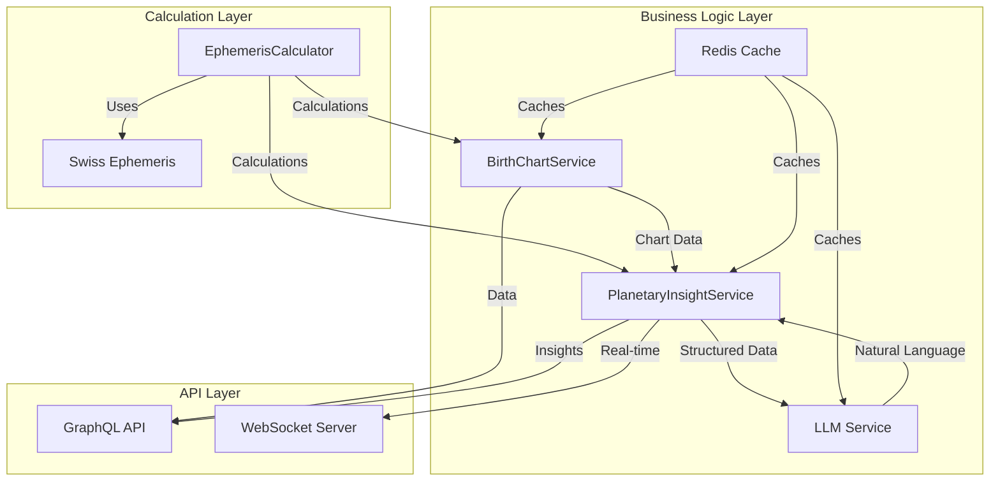

# PulseWisdom Technical Documentation V2

## Vision & Purpose
PulseWisdom is designed to bridge ancient astrological wisdom with modern technology, empowering users to make life decisions in harmony with universal energies. Our mission is to make celestial wisdom accessible, accurate, and practically applicable in daily life, helping users understand and align with cosmic patterns for better decision-making and personal growth.

## Project Overview
PulseWisdom is a cross-platform astronomical insights application built with React Native and React Native Web. The application provides personalized action recommendations based on planetary movements, alignments, and astronomical events, helping users make decisions that are in harmony with universal energies. Key features include:

### Key Features
1. **Birth Chart Analysis**
   - Professional-grade birth chart calculations
   - Interactive chart visualization
   - Detailed planetary positions and aspects
   - Multiple house system support
   - Comprehensive aspect interpretation
   - Personal point calculations

2. **Planetary Alignment Insights**
   - Real-time planetary position tracking
   - Transit analysis and predictions
   - Aspect pattern recognition
   - Dignity and essential nature calculations
   - Predictive timing recommendations

3. **Actionable Recommendations**
   - Daily decision guidance
   - Optimal timing suggestions
   - Personal growth opportunities
   - Life area focus recommendations
   - Relationship compatibility insights
   - Career and life path guidance

### Core Value Propositions
1. **Precise Astrological Calculations**
   - High-precision ephemeris calculations
   - Accurate birth chart generation
   - Real-time planetary position tracking
   - Multiple house system support
   - Advanced aspect pattern detection
   - Dignity and essential nature analysis

2. **Personalized Insights**
   - Birth chart analysis and interpretation
   - Transit and progression analysis
   - Planetary aspect interpretations
   - Dignity-based recommendations
   - Daily life area guidance
   - Personal timing optimization

3. **Real-time Guidance**
   - Live planetary movement updates
   - Timely action recommendations
   - Predictive transit alerts
   - Personal timing optimization
   - Decision-making support
   - Life area focus alerts

### Decision Support Framework
Our technical implementation specifically supports decision-making through:

1. **Timing Optimization**
   - Why: Help users choose optimal moments for actions
   - How: Real-time planetary calculations and aspect analysis
   - Benefit: Better-timed decisions aligned with cosmic energies

2. **Life Area Analysis**
   - Why: Provide focused guidance for specific life domains
   - How: House system analysis and planetary dignity calculations
   - Benefit: Context-aware recommendations for different life areas

3. **Personal Growth Tracking**
   - Why: Support long-term development and awareness
   - How: Progressive analysis of transits and patterns
   - Benefit: Continuous alignment with personal growth opportunities

### Technical Goals Alignment
Each technical choice is made to support our core mission:

1. **Cross-Platform Architecture**
   - Why: Ensure accessibility across all devices
   - How: React Native + Web implementation
   - Benefit: Single codebase, consistent experience

2. **Real-time Updates**
   - Why: Provide timely astrological insights
   - How: WebSocket + GraphQL Subscriptions
   - Benefit: Instant planetary updates and notifications

3. **Calculation Precision**
   - Why: Ensure astrological accuracy
   - How: Swiss Ephemeris integration
   - Benefit: Professional-grade astronomical calculations

4. **AI Integration**
   - Why: Enhance interpretation quality
   - How: LLM-based natural language processing
   - Benefit: Nuanced and personalized astrological insights

### Component Relationships & Dependencies

#### Core Service Architecture


#### Service Interactions

1. **EphemerisCalculator → Birth Chart Service**
   - **Purpose**: Core astronomical calculations
   - **Key Operations**:
     * Birth chart generation
     * House system calculations
     * Aspect calculations
   - **Data Flow**:
     ```typescript
     interface BirthChartCalculation {
       input: {
         datetime: DateTime;
         location: GeoPosition;
         houseSystem: HouseSystem;
       };
       output: {
         bodies: CelestialBody[];
         houses: House[];
         angles: ChartAngles;
       };
     }
     ```

2. **Birth Chart Service → Planetary Insight Service**
   - **Purpose**: Transit and progression analysis
   - **Shared Resources**:
     * Birth chart data
     * Planetary positions
     * House placements
   - **Integration Points**:
     ```typescript
     interface ServiceIntegration {
       birthChart: {
         id: string;
         bodies: CelestialBody[];
         houses: House[];
         angles: ChartAngles;
       };
       insights: {
         transits: Transit[];
         progressions: Progression[];
         dignities: Dignity[];
       };
     }
     ```

3. **Planetary Insight Service → LLM Service**
   - **Purpose**: Natural language interpretation
   - **Key Features**:
     * Birth chart interpretation
     * Transit analysis
     * Timing recommendations
   - **Data Flow**:
     ```typescript
     interface LLMRequest {
       input: {
         type: 'BIRTH_CHART' | 'TRANSIT' | 'TIMING';
         data: BirthChart | Transit[] | TimingRequest;
         context?: UserPreferences;
       };
       output: {
         interpretation: string;
         recommendations?: string[];
         confidence: number;
       };
     }
     ```

4. **Caching Strategy**
   - **Purpose**: Optimize common requests
   - **Implementation**:
     ```typescript
     interface CacheConfig {
       birthChart: {
         ttl: '7d',  // Birth charts rarely change
         key: `chart:${userId}`
       };
       transits: {
         ttl: '1h',  // Planetary positions change
         key: `transit:${date}`
       };
       interpretations: {
         ttl: '24h', // Balance freshness vs cost
         key: `interp:${type}:${hash}`
       };
     }
     ```

#### API Architecture Decisions

1. **GraphQL Implementation**
   - **Why GraphQL Over REST**:
     * Flexible data fetching for complex astrological data
     * Type-safe schema for astrological calculations
     * Real-time subscription support for planetary updates
     * Reduced over-fetching in chart calculations
   - **Key Benefits**:
     ```typescript
     // Example of efficient data fetching
     query BirthChartWithInsights {
       birthChart(id: "123") {
         bodies {
           # Only fetch needed planetary data
           bodyId
           longitude
           latitude
           ...onlyRequiredFields
         }
         insights {
           # Fetch specific insights
           transits
           recommendations
         }
       }
     }
     ```

2. **WebSocket Integration**
   - **Purpose**: Real-time Astrological Updates
   - **Implementation Strategy**:
     * Dedicated channels for different update types
     * Efficient binary message format
     * Automatic reconnection handling
   - **Update Types**:
     ```typescript
     interface WebSocketUpdates {
       PLANETARY_POSITIONS: {
         timestamp: number;
         bodies: PlanetaryPosition[];
       };
       TRANSIT_ALERTS: {
         type: TransitType;
         bodies: [CelestialBody, CelestialBody];
         aspect: AspectType;
       };
       TIMING_GUIDANCE: {
         recommendation: string;
         urgency: 'immediate' | 'upcoming';
         validUntil: number;
       };
     }
     ```

3. **Caching Strategy**
   - **Purpose**: Optimize Astrological Calculations
   - **Implementation**:
     * Redis for ephemeris calculations
     * In-memory caching for frequent requests
     * Cache invalidation based on planetary movements
   - **Cache Hierarchy**:
     ```typescript
     interface CacheStrategy {
       ephemeris: {
         key: `ephemeris:${date}:${body}`;
         ttl: 24 * 60 * 60; // 1 day
       };
       birthChart: {
         key: `chart:${userId}:${timestamp}`;
         ttl: 7 * 24 * 60 * 60; // 1 week
       };
       transits: {
         key: `transits:${chartId}:${date}`;
         ttl: 60 * 60; // 1 hour
       };
     }
     ```

#### Real-time Astrological Event Handling

1. **Event Types & Priority**
   ```typescript
   interface AstrologicalEvent {
     type: 'TRANSIT' | 'PROGRESSION' | 'ASPECT_FORMING' | 'DIGNITY_CHANGE';
     priority: 'IMMEDIATE' | 'HIGH' | 'MEDIUM' | 'LOW';
     timing: {
       start: number;
       peak: number;
       end: number;
     };
     bodies: CelestialBody[];
     impact: {
       lifeAreas: string[];
       significance: number;
       duration: string;
     };
   }
   ```

2. **Event Processing Pipeline**
   ```mermaid
   graph LR
     A[Ephemeris Calculator] -->|Raw Events| B[Event Processor]
     B -->|Filtered Events| C[Priority Queue]
     C -->|High Priority| D[WebSocket]
     C -->|Medium Priority| E[GraphQL Subscription]
     F[AI Service] -->|Enhanced Context| B
     G[User Preferences] -->|Filtering Rules| B
   ```

3. **Update Delivery Strategy**
   - **Immediate Updates** (WebSocket):
     * Exact aspect formations
     * Critical transit alerts
     * Time-sensitive recommendations
   
   - **Batched Updates** (GraphQL Subscription):
     * Daily planetary positions
     * Upcoming transit previews
     * General timing guidance

4. **Client-Side Integration**
   ```typescript
   interface EventHandler {
     onCriticalTransit: (event: AstrologicalEvent) => void;
     onAspectFormation: (aspect: AspectEvent) => void;
     onTimingGuidance: (guidance: TimingGuidance) => void;
     onDignityChange: (dignity: DignityEvent) => void;
   }
   ```

#### Error Recovery & Data Consistency

1. **Service Recovery Patterns**
   ```typescript
   interface ServiceRecovery {
     // Ephemeris calculation errors
     ephemerisFailure: {
       fallback: 'cached_calculation' | 'approximation' | 'historical_data';
       maxRetries: number;
       backoffStrategy: 'exponential' | 'linear';
     };
     
     // Real-time update failures
     updateFailure: {
       reconnectionStrategy: 'immediate' | 'backoff';
       stateSynchronization: 'full' | 'differential';
       conflictResolution: 'server_wins' | 'latest_wins';
     };
     
     // AI service disruptions
     aiFailure: {
       fallbackMode: 'template_based' | 'cached_response' | 'simplified_prompt';
       retryStrategy: {
         maxAttempts: number;
         backoffMs: number;
         alternateProvider?: 'claude' | 'gpt';
       };
       costControl: {
         maxTokens: number;
         fallbackThreshold: number;
       };
     };
   }
   ```

2. **Data Consistency Measures**
   - **Cross-Service Validation**:
     ```typescript
     interface ConsistencyCheck {
       birthChart: {
         validateHouses: () => boolean;
         validateAspects: () => boolean;
         validateDignities: () => boolean;
       };
       planetaryInsights: {
         validateTransits: () => boolean;
         validateProgressions: () => boolean;
         validateInterpretations: () => boolean;
       };
     }
     ```
   
   - **Recovery Actions**:
     ```typescript
     interface RecoveryAction {
       type: 'RECALCULATE' | 'SYNC' | 'INVALIDATE_CACHE';
       scope: 'SINGLE_CHART' | 'USER_DATA' | 'GLOBAL_CACHE';
       priority: number;
       dependencies: string[];
     }
     ```

3. **State Synchronization**
   - **Version Control**:
     ```typescript
     interface StateVersion {
       birthChart: number;
       transits: number;
       insights: number;
       lastSync: number;
     }
     ```
   
   - **Conflict Resolution**:
     ```typescript
     interface ConflictResolution {
       strategy: 'LAST_WRITE_WINS' | 'MERGE' | 'MANUAL';
       mergeRules: {
         birthChart: MergeStrategy;
         transits: MergeStrategy;
         insights: MergeStrategy;
       };
     }
     ```

#### Monitoring & Observability

1. **Astrological Event Monitoring**
   ```typescript
   interface AstrologicalMetrics {
     eventProcessing: {
       throughput: number;  // Events/second
       latency: {
         calculation: number;  // ms
         delivery: number;    // ms
       };
       accuracy: {
         ephemerisCalculations: number;  // % accuracy
         transitPredictions: number;     // % accuracy
       };
     };
     
     serviceHealth: {
       ephemerisCalculator: ServiceStatus;
       birthChartService: ServiceStatus;
       planetaryInsightService: ServiceStatus;
       aiService: {
         status: ServiceStatus;
         responseTime: number;
         tokenUsage: {
           prompt: number;
           completion: number;
           total: number;
         };
         qualityMetrics: {
           accuracyScore: number;
           consistencyScore: number;
           relevanceScore: number;
         };
         costs: {
           hourly: number;
           daily: number;
           monthly: number;
         };
       };
       
       userEngagement: {
         activeSubscriptions: number;
         averageResponseTime: number;
         insightUtilization: number;  // % of insights acted upon
       };
     };
   }
   ```

2. **Critical Path Monitoring**
   ```mermaid
   graph TD
     A[User Request] -->|Latency| B[API Gateway]
     B -->|Availability| C[Service Layer]
     C -->|Accuracy| D[Ephemeris Calculator]
     C -->|Response Time| E[AI Service]
     
     subgraph Metrics
       F[Error Rates]
       G[Cache Hit Rates]
       H[Calculation Accuracy]
       I[LLM Response Quality]
       J[Token Usage]
       K[Response Times]
     end
     
     subgraph Alerts
       L[Service Degradation]
       M[Calculation Errors]
       N[Token Usage Spikes]
       O[Response Quality Drops]
       P[Cost Threshold Alerts]
     end
   ```

3. **Service Level Objectives (SLOs)**
   ```typescript
   interface AstrologicalSLOs {
     availability: {
       target: '99.9%';
       measurement: 'successful_requests / total_requests';
       window: '30d';
     };
     
     accuracy: {
       ephemerisCalculations: {
         target: '99.999%';
         tolerance: '±1 arc minute';
       };
       transitPredictions: {
         target: '99.9%';
         tolerance: '±1 minute timing';
       };
     };
     
     latency: {
       birthChartGeneration: {
         target: '2s';
         p95: '3s';
         p99: '5s';
       };
       realTimeUpdates: {
         target: '500ms';
         p95: '1s';
         p99: '2s';
       };
     };
   }
   ```

4. **Alert Correlation**
   ```typescript
   interface AlertCorrelation {
     patterns: {
       'high_latency + cache_miss': {
         diagnosis: 'Cache performance degradation';
         action: 'Scale Redis cluster';
       };
       'calculation_errors + ai_low_confidence': {
         diagnosis: 'Data quality issues';
         action: 'Validate ephemeris data';
       };
       'websocket_drops + high_cpu': {
         diagnosis: 'Resource contention';
         action: 'Scale event processors';
       };
     };
     
     recovery: {
       automated: string[];  // List of auto-recovery actions
       manual: string[];    // List of manual intervention needed
       notification: {
         channels: string[];
         priority: 'low' | 'medium' | 'high';
       };
     };
   }
   ```

5. **Observability Integration**
   ```typescript
   interface ObservabilityStack {
     metrics: {
       collection: 'Prometheus';
       storage: 'VictoriaMetrics';
       retention: '90d';
     };
     
     logging: {
       transport: 'Vector';
       storage: 'Loki';
       retention: '30d';
     };
     
     tracing: {
       implementation: 'OpenTelemetry';
       sampling: {
         default: 0.1;
         errorEvents: 1.0;
         criticalPaths: 1.0;
       };
     };
     
     dashboards: {
       astrological: {
         accuracy: string[];    // Accuracy metrics
         performance: string[]; // Performance metrics
         insights: string[];    // Insight delivery metrics
       };
       technical: {
         services: string[];    // Service health metrics
         resources: string[];   // Resource utilization
         errors: string[];      // Error tracking
       };
     };
   }
   ```

## Architecture Overview

The architecture follows a modern monorepo approach with clear separation of concerns, shared packages, and platform-specific implementations. This design emphasizes code reusability, maintainability, and scalability while ensuring optimal performance across all platforms.

### Key Architectural Principles
Each principle directly supports our mission:

1. **Clear Separation of Concerns**
   - Purpose: Maintain calculation accuracy and insight quality
   - Implementation: Modular services for specific astrological functions
   - Benefit: Reliable and maintainable astrological calculations

2. **Code Reusability**
   - Purpose: Consistent astrological interpretations
   - Implementation: Shared packages for core logic
   - Benefit: Uniform experience across platforms

3. **Platform-specific Optimizations**
   - Purpose: Best possible user experience
   - Implementation: Native capabilities where beneficial
   - Benefit: Optimal performance for astrological visualizations

4. **Scalable Infrastructure**
   - Purpose: Handle growing user base and calculation complexity
   - Implementation: Distributed architecture with caching
   - Benefit: Fast and reliable astrological insights

5. **Security by Design**
   - Purpose: Protect sensitive birth data
   - Implementation: End-to-end encryption and secure storage
   - Benefit: User trust and data privacy

6. **Performance-first Approach**
   - Purpose: Instant astrological insights
   - Implementation: Optimized calculations and caching
   - Benefit: Real-time planetary updates and analysis

### Monorepo Structure
```
PulseWisdom/
├── apps/                  # Application implementations
│   ├── mobile/           # React Native mobile app
│   │   ├── ios/         # iOS-specific code
│   │   └── android/     # Android-specific code
│   ├── web/             # Web application
│   └── backend/         # Node.js backend
├── packages/             # Shared packages
│   ├── core/            # Core business logic
│   │   ├── astrology/   # Astrological calculations
│   │   ├── insights/    # Planetary alignment insights
│   │   └── user/        # User management
│   ├── ui/              # Shared UI components
│   │   ├── mobile/      # Mobile-specific components
│   │   └── web/         # Web-specific components
│   ├── ephemeris/       # Swiss Ephemeris wrapper
│   │   ├── native/      # Native bindings
│   │   └── wasm/        # WebAssembly implementation
│   └── config/          # Shared configuration
├── tools/               # Development and deployment tools
│   ├── scripts/        # Build and deployment scripts
│   └── ci/             # CI/CD configurations
└── docs/               # Documentation
    ├── api/            # API documentation
    └── architecture/   # Architecture documentation
```

### Backend Architecture
```
backend/
├── src/
│   ├── api/              # API layer
│   │   ├── graphql/     # GraphQL implementation
│   │   │   ├── schema.ts    # GraphQL type definitions
│   │   │   ├── resolvers.ts # Query/Mutation/Subscription resolvers
│   │   │   └── types/       # GraphQL-specific types
│   │   └── websocket/   # Real-time planetary updates
│   │       └── PlanetaryUpdatesServer.ts
│   ├── core/            # Core business logic
│   │   ├── astrology/   # Astrological calculations
│   │   ├── insights/    # Planetary alignment insights
│   │   └── user/        # User management
│   ├── infrastructure/  # External services
│   │   ├── database/    # Database access
│   │   ├── cache/       # Redis caching layer
│   │   │   └── RedisCache.ts
│   │   ├── queue/       # Message queue
│   │   └── ephemeris/   # Swiss Ephemeris integration
│   └── shared/          # Shared utilities
├── tests/              # Test suites
│   ├── unit/          # Unit tests
│   ├── integration/   # Integration tests
│   └── e2e/          # End-to-end tests
└── config/            # Environment configurations
```

### Frontend Architecture (Mobile & Web)
```
apps/[platform]/
├── src/
│   ├── features/           # Feature modules
│   │   ├── birthChart/    # Birth chart feature
│   │   │   ├── components/
│   │   │   ├── hooks/
│   │   │   ├── state/
│   │   │   └── api/
│   │   ├── insights/      # Planetary insights feature
│   │   └── actions/       # Recommended actions feature
│   ├── shared/           # Shared code
│   │   ├── components/   # Common components
│   │   ├── hooks/       # Common hooks
│   │   └── utils/       # Utilities
│   ├── navigation/      # Navigation setup
│   ├── state/          # Global state management
│   └── api/            # API integration
└── tests/             # Test suites
```

### Data Flow Architecture
```
┌──────────────┐     ┌──────────────┐     ┌──────────────┐
│   Frontend   │     │    Backend   │     │   Services   │
│  (Mobile/Web)│ ──> │  (Node.js)   │ ──> │  (External)  │
└──────────────┘     └──────────────┘     └──────────────┘
       │                    │                    │
       │                    │                    │
       v                    v                    v
┌──────────────┐     ┌──────────────┐     ┌──────────────┐
│    Cache     │     │   Database   │     │  Ephemeris   │
│    (Redis)   │     │  (MongoDB)   │     │  (Native/WASM)│
└──────────────┘     └──────────────┘     └──────────────┘
       │                    │                    │
       │                    │                    │
       v                    v                    v
┌──────────────┐     ┌──────────────┐     ┌──────────────┐
│   WebSocket  │     │   GraphQL    │     │  Real-time   │
│  Subscribers │     │   Resolvers  │     │   Updates    │
└──────────────┘     └──────────────┘     └──────────────┘
```

### State Management
- Redux Toolkit for global state
- React Query for server state
- Context for UI state
- Persistence strategy
- State synchronization

### API Layer
- GraphQL API with type-safe resolvers
  - Queries for birth charts and planetary insights
  - Mutations for managing birth charts
  - Subscriptions for real-time planetary updates
- WebSocket server for real-time data
  - Efficient connection management
  - Automatic reconnection handling
  - Broadcast updates to subscribers
- Redis caching layer
  - Planetary position caching
  - Birth chart caching
  - Insight caching
  - Configurable TTL
- Proper request/response validation
- Rate limiting and security measures
- API versioning support

### Performance Optimization
- Web Workers for heavy calculations
- Code splitting and lazy loading
- Asset optimization
- Proper caching strategies
  - Redis caching layer
    - Planetary position caching
    - Birth chart caching
    - Insight caching
    - Configurable TTL
  - GraphQL query optimization
    - Field-level caching
    - Query batching
    - Persisted queries
    - Query complexity analysis
  - WebSocket optimization
    - Connection pooling
    - Message batching
    - Heartbeat mechanism
    - Automatic reconnection
- Server-side rendering for web
- Performance monitoring and metrics
  - GraphQL metrics
    - Query execution time
    - Error rates
    - Cache hit rates
  - WebSocket metrics
    - Active connections
    - Message throughput
    - Connection duration
  - Redis metrics
    - Cache hit/miss rates
    - Memory usage
    - Operation latency

- **Astrological Calculation Optimization**
  - Ephemeris calculation batching
    - Group calculations by time period
    - Parallel processing for multiple bodies
    - Pre-calculation of common configurations
  - Aspect pattern detection
    - Optimized geometric algorithms
    - Pattern caching for frequent configurations
    - Incremental updates for real-time changes
  - Dignity calculations
    - Pre-computed dignity tables
    - Essential dignity scoring optimization
    - Accidental dignity caching

- **LLM Integration Optimization**
  - Response Management
    - Prompt template optimization
    - Response caching strategy
    - Batch request handling
  - Cost Optimization
    - Token usage monitoring
    - Request batching
    - Cache hit ratio optimization
  - Quality Control
    - Response validation pipeline
    - Astrological accuracy checks
    - Content filtering system

### Security Measures
- JWT-based authentication
- Role-based access control
- Input validation and sanitization
- Rate limiting
- Security headers
- CORS configuration
- Secure storage for sensitive data
- GraphQL-specific security
  - Query depth limiting
  - Query complexity analysis
  - Field-level permissions
  - Operation whitelisting
- WebSocket security
  - Connection authentication
  - Message validation
  - Rate limiting per connection
  - Secure WebSocket (WSS) support
- Redis security
  - Password protection
  - TLS encryption
  - Access control lists
  - Network isolation
  - Regular security updates

### Testing Strategy
- Unit tests for business logic
- Integration tests for API endpoints
- E2E tests with Detox (mobile) and Cypress (web)
- Performance testing
- Security testing
- Snapshot testing for UI components
- GraphQL testing
  - Schema validation tests
  - Resolver unit tests
  - Query/Mutation tests
  - Subscription tests
  - Error handling tests
  - Performance benchmarks
- WebSocket testing
  - Connection lifecycle tests
  - Message handling tests
  - Reconnection tests
  - Load testing
  - Security tests
- Redis testing
  - Cache hit/miss tests
  - TTL tests
  - Connection tests
  - Performance tests
  - Error handling tests
- Test data management
  - Mock data generation
  - Test database seeding
  - Cache state management
  - WebSocket state simulation

### Testing Best Practices
- **Mock Data Management**
  - Consistent mock structures
  - Type-safe mock implementations
  - Reusable mock helpers
  - Clear mock documentation
  - GraphQL mock resolvers
  - WebSocket mock messages
  - Redis mock responses

- **Test Organization**
  - Logical test grouping
  - Clear test descriptions
  - Proper setup/teardown
  - Isolation principles
  - GraphQL test suites
  - WebSocket test suites
  - Redis test suites

- **Error Handling**
  - Comprehensive error cases
  - Clear error messages
  - Proper error propagation
  - Recovery scenarios
  - GraphQL error handling
  - WebSocket error handling
  - Redis error handling

### Performance Considerations
- **Test Execution**
  - Parallel test execution
  - Resource cleanup
  - Memory management
  - Execution time optimization
  - GraphQL query optimization
  - WebSocket connection management
  - Redis connection pooling

- **Mock Performance**
  - Efficient mock implementations
  - Minimal overhead
  - Resource utilization
  - Memory footprint
  - GraphQL mock performance
  - WebSocket mock performance
  - Redis mock performance

### CI/CD Pipeline
- Automated testing
- Code quality checks
- Security scanning
- Automated deployments
- Environment management
- Version control strategy

### Monitoring and Logging
- Application performance monitoring
- Error tracking and reporting
- User analytics
- Server metrics
- Logging strategy
- Alerting system

### Theme System
- **Colors**: Purple-based color scheme with platform-specific adjustments
- **Typography**: Platform-specific font stacks
- **Spacing**: Consistent spacing system across platforms
- **Breakpoints**: Responsive design breakpoints for web
- **Shadows**: Platform-specific shadow implementations

### Platform-Specific Features
1. **Web**
   - Responsive layouts
   - Hover states
   - Touch-friendly interactions
   - SEO optimization
   - Progressive Web App capabilities

2. **Mobile**
   - Native gestures
   - Platform-specific animations
   - Native navigation patterns
   - Touch feedback
   - Offline support

## Technical Stack

### Frontend (MVP Focus)
- React Native (Mobile)
- React Native Web (Web)
- TypeScript
- Redux Toolkit (State Management)
- React Query (Data Fetching)
- Apollo Client (GraphQL)
- Styled Components (Styling)
- React Navigation (Routing)
- D3.js (Data Visualization)
  - Custom birth chart components
  - Interactive zodiac wheel
  - Basic aspect visualization
  - House system rendering
  - Essential planet positioning
  - Basic touch interactions
  - Core responsive design

### Frontend (Post-MVP Enhancements)
- Advanced D3.js Features
  - Complex aspect pattern visualization
  - Transit overlay system
  - Advanced touch and gesture support
  - Enhanced responsive utilities
  - Multiple chart comparison views
  - Advanced animation systems
- Progressive Web App capabilities
- Advanced offline support
- Complex state management patterns
- Enhanced real-time updates

### Backend (MVP Focus)
- Node.js
- TypeScript
- Express
- @apollo/server (GraphQL)
- graphql (^16.8.1)
- ws (WebSocket Server)
- MongoDB
- Redis (Caching)
- ioredis (Redis Client)
- Swiss Ephemeris
- Basic LLM integration (Claude/ChatGPT)

### Backend (Post-MVP Enhancements)
- Advanced caching hierarchies
- Message queuing system
- Advanced error recovery patterns
- Enhanced LLM features
  - Complex prompt engineering
  - Multi-provider fallback
  - Advanced cost optimization
- Extended WebSocket capabilities
- Advanced data analytics pipeline

### DevOps (MVP Focus)
- Docker
- GitHub Actions
- Basic monitoring with Prometheus & Grafana
- Essential security measures
- Simple deployment pipeline

### DevOps (Post-MVP)
- Advanced monitoring and alerting
- Enhanced security measures
- Complex deployment strategies
- Performance optimization tools
- Advanced logging systems

### Security Implementation

(MVP)
- JWT authentication
- Basic role-based access
- Essential data encryption
- Standard security headers
- Basic rate limiting

(Post-MVP)
- Enhanced encryption systems
- Advanced access controls
- Comprehensive security monitoring
- Advanced rate limiting
- Security audit logging

### Monitoring Implementation

(MVP)
- Basic service health checks
- Essential error tracking
- Core metrics collection
- Simple alerting rules
- Basic performance monitoring

(Post-MVP)
- Advanced metric correlations
- Complex alerting patterns
- Detailed performance tracking
- User behavior analytics
- Advanced error analysis

## Implementation Status

### Completed & Essential
1. **Core Calculation Engine**
   - Birth chart calculations
   - Planetary positions
   - House system calculations (Placidus and Equal)
   - Basic aspect calculations
   - Essential test coverage

2. **Basic Backend Infrastructure**
   - MongoDB integration
   - Redis basic caching
   - GraphQL API essentials
   - Simple WebSocket updates
   - Basic error handling

3. **LLM Integration**
   - Basic API integration
   - Simple prompt templates
   - Essential caching
   - Basic validation

### In Progress (MVP Priority)
1. **Frontend Development**
   - Birth chart visualization
   - Basic user interface
   - Essential interactions
   - Core data fetching

2. **Testing Implementation**
   - Core service unit tests
   - Basic integration tests
   - Essential end-to-end tests
   - Critical path testing

### Deferred Features
1. **Advanced Monitoring**
   - Complex metric correlations
   - Advanced alerting systems
   - Detailed audit trails
   - Sophisticated performance tracking

2. **Complex Infrastructure**
   - Advanced caching strategies
   - Complex WebSocket features
   - Advanced error recovery
   - Sophisticated deployment patterns

3. **Extended Testing**
   - Advanced edge cases
   - Complex integration scenarios
   - Performance benchmarking
   - Security penetration testing

4. **UI/UX Enhancements**
   - Advanced animations
   - Complex gesture handling
   - Sophisticated offline support
   - Advanced chart interactions

## Test Suite Improvements (March 22, 2024)

### Essential Test Infrastructure (MVP Focus)
1. **Core Service Testing**
   - Birth chart calculation validation
   - Planetary position accuracy
   - Basic aspect calculations
   - Essential error handling
   - Basic integration flows

2. **LLM Integration Testing**
   - API connection validation
   - Basic prompt testing
   - Response validation
   - Simple error handling
   - Cache hit/miss verification

3. **Frontend Testing**
   - Chart rendering accuracy
   - Basic user interactions
   - Data fetching validation
   - Essential UI flows
   - Cross-platform compatibility

### Test Configuration (MVP Focus)
- Jest and React Testing Library setup
- Basic CI integration with GitHub Actions
- Essential environment variables
- Simple mock data management
- Core test utilities

### Deferred Testing Components
1. **Advanced Service Testing**
   - Complex edge cases
   - Advanced error scenarios
   - Performance benchmarking
   - Load testing
   - Security testing

2. **Infrastructure Testing**
   - Complex WebSocket scenarios
   - Advanced caching patterns
   - Kubernetes deployment
   - Complex monitoring setups
   - Advanced security measures

3. **Extended UI Testing**
   - Complex gesture handling
   - Advanced animations
   - Extensive cross-browser testing
   - Advanced accessibility testing
   - Performance profiling

4. **Integration Testing**
   - Complex service interactions
   - Advanced error recovery
   - State management testing
   - WebSocket reconnection scenarios
   - Cache invalidation patterns

### MongoDB Test Infrastructure (MVP Focus)
- **Essential Database Testing**
  - Basic CRUD operations
  - Simple data validation
  - Core error scenarios
  - Connection management
  - Basic cleanup routines

- **Test Data Management**
  - Core mock data sets
  - Essential fixtures
  - Basic seeding scripts
  - Simple cleanup utilities

### Service Testing (MVP Focus)
- **Birth Chart Service**
  - Core calculation validation
  - Basic data persistence
  - Essential error handling
  - Simple integration tests

- **Planetary Insight Service**
  - Basic transit calculations
  - Core aspect validation
  - Essential caching tests
  - Simple error scenarios

### Deferred Test Infrastructure
1. **Advanced Database Testing**
   - Complex query patterns
   - Advanced indexing
   - Replication scenarios
   - Sharding configurations
   - Performance profiling

2. **Extended Service Testing**
   - Complex calculation scenarios
   - Advanced caching patterns
   - Comprehensive error recovery
   - Load testing
   - Security validation

3. **Infrastructure Testing**
   - Advanced monitoring
   - Complex deployment scenarios
   - Scaling tests
   - Failover handling
   - Performance benchmarking

### Current Test Infrastructure Issues (MVP Priority)
1. **Essential Type System**
   - Core type definitions
   - Basic model interfaces
   - Simple validation types
   - Essential error types

2. **Core Test Coverage**
   - Birth chart calculations
   - Basic planetary positions
   - Essential API endpoints
   - Simple error handling

3. **Basic Integration Testing**
   - Core service interactions
   - Essential data flow
   - Basic error scenarios
   - Simple cache validation

### Testing Best Practices (MVP Focus)
1. **Essential Mock Data**
   - Core birth chart data
   - Basic planetary positions
   - Simple aspect patterns
   - Essential user data

2. **Basic Test Organization**
   - Core test suites
   - Essential scenarios
   - Simple setup/teardown
   - Basic isolation

3. **Core Error Handling**
   - Essential validation
   - Basic error flows
   - Simple recovery
   - Core error messages

### Performance Testing (MVP Focus)
1. **Essential Metrics**
   - Core calculation speed
   - Basic response times
   - Simple cache performance
   - Essential memory usage

2. **Basic Load Testing**
   - Core endpoint loads
   - Simple concurrent users
   - Basic stress scenarios
   - Essential bottlenecks

### Deferred Testing Concerns
1. **Advanced Type System**
   - Complex generics
   - Advanced type inference
   - Sophisticated validations
   - Extended error hierarchies

2. **Extended Coverage**
   - Edge case scenarios
   - Complex error paths
   - Advanced integrations
   - Performance profiling

3. **Infrastructure Testing**
   - Advanced scaling
   - Complex deployments
   - Sophisticated monitoring
   - Security penetration

### Test Infrastructure Roadmap
1. **Type System Improvements**
   - Proper enum imports
   - Mock data structure alignment
   - Mongoose model type safety
   - Type assertion standardization

2. **Coverage Enhancement**
   - Edge case implementation
   - Error path testing
   - Integration test expansion
   - Service interaction validation

3. **Documentation Updates**
   - Test documentation
   - Example implementations
   - Data structure documentation
   - Best practices guide

### Testing Best Practices
- **Mock Data Management**
  - Consistent mock structures
  - Type-safe mock implementations
  - Reusable mock helpers
  - Clear mock documentation
  - GraphQL mock resolvers
  - WebSocket mock messages
  - Redis mock responses

- **Test Organization**
  - Logical test grouping
  - Clear test descriptions
  - Proper setup/teardown
  - Isolation principles
  - GraphQL test suites
  - WebSocket test suites
  - Redis test suites

- **Error Handling**
  - Comprehensive error cases
  - Clear error messages
  - Proper error propagation
  - Recovery scenarios
  - GraphQL error handling
  - WebSocket error handling
  - Redis error handling

### Performance Considerations
- **Test Execution**
  - Parallel test execution
  - Resource cleanup
  - Memory management
  - Execution time optimization
  - GraphQL query optimization
  - WebSocket connection management
  - Redis connection pooling

- **Mock Performance**
  - Efficient mock implementations
  - Minimal overhead
  - Resource utilization
  - Memory footprint 
  - GraphQL mock performance
  - WebSocket mock performance
  - Redis mock performance 

### Core Features

#### 1. User Profile & Personalization (MVP)
- **Profile Creation**
  - Birth data input (date, time, location)
  - Personal goals and areas of interest
  - Basic preferences
  - Essential notification settings

- **Personalization** (Post-MVP)
  - Customizable dashboard
  - Focus area selection
  - Advanced notification controls
  - Privacy settings

#### 2. Astrological Analysis

- **Birth Chart Analysis** (MVP)
  - Interactive birth chart visualization
    - D3.js-based circular chart rendering
    - Dynamic planet positioning
    - Basic aspect line visualization
    - House system overlay
    - Zodiac wheel with degrees
    - Responsive design for all screen sizes
    - Basic touch and mouse interactions
    - Planet information tooltips
    - Essential aspect information display
    - House cusps and degrees
    - Retrograde planet indicators
  - Core identity & personality insights
  - Key strengths & focus areas
  - Basic pattern recognition

  (Post-MVP Enhancements)
  - Special points (Chiron, North/South Nodes)
  - Element and modality highlighting
  - Aspect patterns identification
  - Harmonic resonance visualization
  - Real-time transit overlay option
  - Multiple house system support
  - Customizable visual themes
  - Export capabilities (SVG/PNG)
  - Advanced pattern recognition
  - Detailed life themes analysis

- **Daily/Weekly Insights** (MVP)
  - Planetary Position Analysis
    - Current positions of all planets
    - Retrograde status and movements
    - Basic planetary aspects
    - House positions
  - Daily Insights
    - Day-specific planetary positions
    - Key aspects and alignments
    - Basic timing recommendations
    - Essential action suggestions

  (Post-MVP Additions)
  - Advanced Planetary Analysis
    - Special points tracking
    - Element and modality distribution
    - Cardinal/Fixed/Mutable balance
  - Extended Insights
    - Weekly planetary movements
    - Complex aspect patterns
    - Energy shifts and transitions
    - Strategic planning windows
  - Comprehensive Life Area Impact
    - Career and professional growth
    - Personal relationships
    - Health and wellness
    - Creative expression
    - Spiritual development
    - Financial matters

#### 3. Personal Growth Tools

(MVP)
- **Basic Goal Tracking**
  - Simple goal setting
  - Basic astrological alignment
  - Essential progress tracking

(Post-MVP)
- **Advanced Goal System**
  - Comprehensive goal management
  - Deep astrological alignment
  - Pattern recognition
  - Achievement celebration

- **Reflection Journal**
  - Prompt-based journaling
  - Astrological event correlation
  - Pattern recognition
  - Personal growth tracking

#### 4. Educational Content

(MVP)
- **Essential Learning Resources**
  - Basic astrology concepts
  - Simple chart reading guide
  - Core planetary meanings
  - Basic aspect guide

(Post-MVP)
- **Advanced Learning**
  - Comprehensive astrology lessons
  - Detailed interpretation guides
  - Advanced planetary studies
  - Interactive tutorials
  - Chart reading mastery
  - Pattern recognition training

#### 5. Community Features (All Post-MVP)
- **Social Integration**
  - Optional insight sharing
  - Discussion forums
  - Community support
  - Experience exchange

- **Privacy Controls**
  - Content visibility settings
  - Profile privacy options
  - Sharing preferences
  - Data protection

#### 6. Notification System

(MVP)
- **Basic Alerts**
  - Daily insight notifications
  - Major transit alerts
  - Essential reminders

(Post-MVP)
- **Smart Alerts**
  - Customizable notification types
  - Goal milestone notifications
  - Pattern-based alerts
  - Learning prompts
  - Custom alert preferences

### Premium Strategy

#### MVP Premium Features
- **Enhanced Birth Chart Analysis**
  - Detailed aspect interpretations
  - Extended daily insights
  - Basic pattern recognition
  - PDF chart exports

#### Post-MVP Premium Features
- **Advanced Tools**
  - Multiple chart storage
  - Synastry and composite charts
  - Advanced calculations
  - Custom pattern detection
- **Extended Features**
  - Premium notifications
  - Advanced data exports
  - API access
  - Priority support

### Data Integration & Analytics

(MVP)
- **Essential Analytics**
  - Basic usage metrics
  - Core feature tracking
  - Simple progress monitoring

(Post-MVP)
- **Advanced Analytics**
  - Pattern recognition
  - Goal achievement metrics
  - Insight effectiveness tracking
  - Astrological event correlation
  - Personal experience mapping

### Privacy & Security

(MVP)
- **Core Security**
  - Secure birth data storage
  - Basic privacy controls
  - Essential data protection

(Post-MVP)
- **Enhanced Security**
  - End-to-end encryption
  - Advanced privacy controls
  - Comprehensive data visibility settings
  - Enhanced export capabilities
  - Account deletion workflow

### AI/LLM Integration

#### MVP Implementation
- **Core LLM Service**
  ```typescript
  interface CoreLLMService {
    interpretBirthChart: (chart: BirthChart) => Promise<ChartInterpretation>;
    analyzeDailyTransits: (transits: Transit[]) => Promise<DailyGuidance>;
    explainAspectPattern: (pattern: AspectPattern) => Promise<PatternInsight>;
  }
  ```

- **Essential Features**
  - Basic birth chart interpretation
  - Simple transit analysis
  - Core aspect pattern explanations
  - Basic prompt templates
  - Essential error handling
  - Simple response validation
  - Basic caching strategy

- **Cost Management (MVP)**
  ```typescript
  interface CostControl {
    maxTokensPerRequest: number;
    dailyTokenBudget: number;
    cacheTTL: {
      birthChart: '7d',
      transits: '24h',
      aspects: '48h'
    };
    fallbackMode: 'template' | 'cache';
  }
  ```

- **Quality Control (MVP)**
  - Basic response validation
  - Template-based fallbacks
  - Simple accuracy checks
  - Essential error recovery
  - Basic retry logic

#### Post-MVP Enhancements

1. **Advanced Interpretation Engine**
   ```typescript
   interface AdvancedLLMService extends CoreLLMService {
     analyzeAspectPatterns: (patterns: AspectPattern[]) => Promise<DeepInsight>;
     generatePersonalizedGuidance: (context: UserContext) => Promise<Guidance>;
     explainTransitTimings: (transits: Transit[]) => Promise<TimingStrategy>;
     correlateLifeEvents: (events: UserEvent[], transits: Transit[]) => Promise<EventCorrelation>;
   }
   ```

2. **Enhanced Prompt Engineering**
   - Dynamic prompt generation
   - Context-aware templates
   - User preference adaptation
   - Historical interaction learning
   - Astrological expertise weighting

3. **Multi-Provider Strategy**
   ```typescript
   interface ProviderStrategy {
     providers: {
       primary: 'claude' | 'gpt-4';
       fallback: 'gpt-3.5' | 'template';
       specialization: {
         birthChart: 'claude';
         transits: 'gpt-4';
         patterns: 'claude';
       };
     };
     loadBalancing: {
       method: 'round-robin' | 'cost-based' | 'specialization';
       weights: Record<Provider, number>;
     };
     failover: {
       maxAttempts: number;
       backoffStrategy: 'exponential' | 'linear';
       fallbackChain: Provider[];
     };
   }
   ```

4. **Advanced Cost Optimization**
   ```typescript
   interface CostOptimization {
     tokenBudgets: {
       user: {
         daily: number;
         monthly: number;
       };
       system: {
         hourly: number;
         daily: number;
       };
     };
     caching: {
       strategy: 'hierarchical' | 'predictive';
       precomputation: boolean;
       invalidation: 'time-based' | 'event-based';
     };
     batchProcessing: {
       enabled: boolean;
       maxBatchSize: number;
       delayThreshold: number;
     };
   }
   ```

5. **Enhanced Quality Control**
   ```typescript
   interface QualityControl {
     validation: {
       astrologicalAccuracy: boolean;
       languageQuality: boolean;
       contextualRelevance: boolean;
       userAlignment: boolean;
     };
     metrics: {
       accuracy: number;
       consistency: number;
       relevance: number;
       userSatisfaction: number;
     };
     improvement: {
       feedbackLoop: boolean;
       promptRefinement: boolean;
       modelTuning: boolean;
     };
   }
   ```

6. **Learning & Adaptation**
   - Response effectiveness tracking
   - User feedback incorporation
   - Pattern recognition in successful interpretations
   - Automated prompt optimization
   - Context-based template evolution

7. **Integration Optimization**
   ```typescript
   interface IntegrationOptimization {
     streaming: {
       enabled: boolean;
       chunkSize: number;
       progressIndicators: boolean;
     };
     parallelization: {
       enabled: boolean;
       maxConcurrent: number;
       priorityLevels: number;
     };
     monitoring: {
       tokenUsage: boolean;
       responseQuality: boolean;
       userEngagement: boolean;
       costEfficiency: boolean;
     };
   }
   ```

#### Error Handling & Recovery (MVP)
```typescript
interface ErrorHandling {
  // MVP Error Handling
  basic: {
    retryAttempts: number;
    fallbackToTemplate: boolean;
    cacheUsage: 'on-error' | 'never';
    errorNotification: boolean;
  };
  
  // Post-MVP Error Handling
  advanced: {
    contextualRecovery: boolean;
    intelligentFallback: boolean;
    userNotification: {
      immediate: boolean;
      aggregated: boolean;
      severity: 'info' | 'warning' | 'error';
    };
    logging: {
      detailed: boolean;
      analytics: boolean;
      debugging: boolean;
    };
  };
}
```

#### Caching Strategy (MVP)
```typescript
interface CachingStrategy {
  // MVP Caching
  basic: {
    birthChart: {
      ttl: '7d';
      invalidateOnUpdate: boolean;
    };
    transits: {
      ttl: '24h';
      invalidateOnPlanetary: boolean;
    };
    aspects: {
      ttl: '48h';
      invalidateOnChange: boolean;
    };
  };

  // Post-MVP Caching
  advanced: {
    hierarchical: boolean;
    predictive: boolean;
    userSpecific: boolean;
    costAware: boolean;
    analytics: {
      hitRate: boolean;
      costSavings: boolean;
      performance: boolean;
    };
  };
}
```

// ... existing code ... 